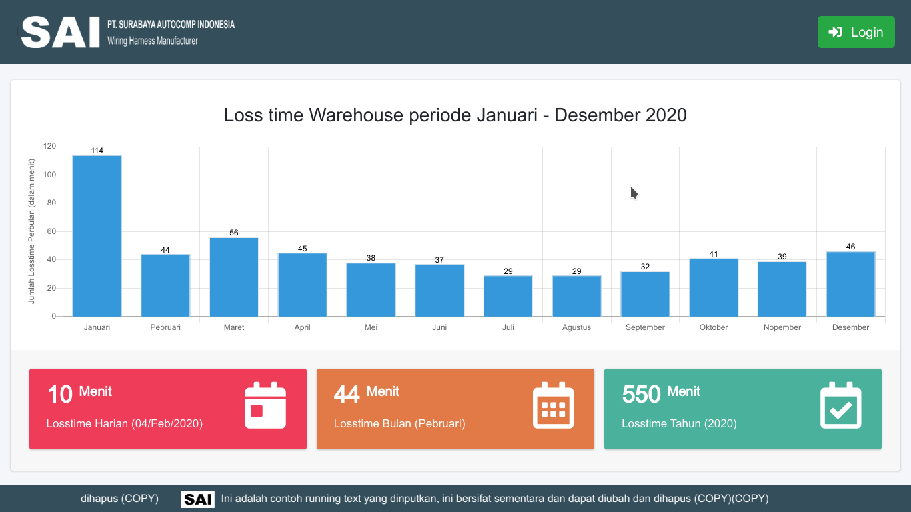

# Warehouse Visualitation

## Requirement
- PHP 7.4.1
- Apache/2.4.29 (Ubuntu)
- Versi Server: 5.7.28-0ubuntu0.18.04.4 - (Ubuntu)

## Template
- adminLTE [ <a href="https://adminlte.io">https://adminlte.io/</a> ] 

## Package
- Bootstrap 4 [ <a href="https://getbootstrap.com">https://getbootstrap.com</a> ]
- ChartJS [ <a href="https://www.chartjs.org/">https://www.chartjs.org</a> ]
- Select2 [ <a href="https://select2.org">https://select2.org</a> ]
- DataTables [ <a href="https://datatables.net">https://datatables.net</a> ]
- Sweetalert2 [ <a href="https://sweetalert2.github.io">https://sweetalert2.github.io/</a> ]

## Screenshot

1. Dashboard Awal

 
2. Admin
