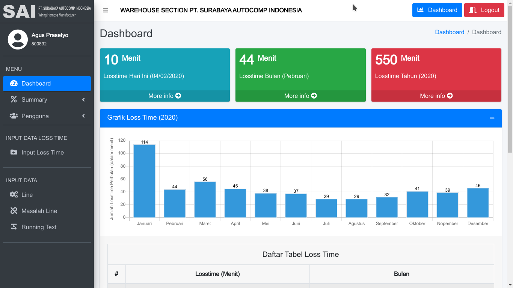

# Warehouse Losstime Visualitation


## Requirement
- PHP 7.4.1
- Apache/2.4.29 (Ubuntu)
- Versi Server: 5.7.28-0ubuntu0.18.04.4 - (Ubuntu)

## Template
- adminLTE [ <a href="https://adminlte.io">https://adminlte.io/</a> ] 

## Package
- Bootstrap 4 [ <a href="https://getbootstrap.com">https://getbootstrap.com</a> ]
- ChartJS [ <a href="https://www.chartjs.org/">https://www.chartjs.org</a> ]
- Select2 [ <a href="https://select2.org">https://select2.org</a> ]
- DataTables [ <a href="https://datatables.net">https://datatables.net</a> ]
- Sweetalert2 [ <a href="https://sweetalert2.github.io">https://sweetalert2.github.io/</a> ]

## Screenshot
1. Dashboard Awal

<br>
2. Dashboard Admin


## Documentation

### Alur Kerja program
1. Ketika pertama kali menjalankan program, halaman pertama yang muncul adalah halaman <b>DASHBOARD</b>, halaman dashboard ini menampilkan data losstime perbulan berupa grafik dan data-data seperti jumlah losstime harian, jumlah losstime bulanan, dan jumlah losstime tahunan
2. Jika ingin mengisi data losstime maka yang harus dilakukan adalah login terlebih dahulu
> untuk akun pengguna yang bisa mendaftarkan adalah admin/foreman dari warehouse
3. Setelah berhasil login setelah itu adalah diarahkan sesuai dengan hak akses masing-masing, didalam program terdapat 2 (dua) hak akses yaitu : 
   - Admin dan Foreman
      1. Manajemen Pengguna (Tambah, Edit pengguna)
      2. Manajemen Losstime (Edit, Hapus losstime)
      3. Manajemen Line (Tambah, Edit, Hapus Line)
      4. Manajemen Masalah Line (Tambah, Edit, Hapus Masalah Line)
      5. Manajemen Running Text (Tambah, Edit, Hapus Running Text)
      6. Input Data Losstime
      7. Melihat report dan visualisasi losstime (Harian, Mingguan, Bulanan, Tahunan)
      8. Ubah Password Pengguna

   - Operator
      1. Input Data Losstime
      2. Melihat report dan visualisasi losstime (Harian, Mingguan, Bulanan, Tahunan)
      3. Ubah Password Pengguna

### Penataan Folder Project
- `index.php` <br>
  Menampilkan dashboard awal yang terdiri dari grafik per bulan, jumlah losstime perhari, perbulan, dan pertahun sekarang. Serta menampilkan running-text.
- `login.php` <br>
  Menampilkan form login
- [ data ]
   - [ class ]
      - `dataStatis.php` <br>
         File ini berisi konstruktor yang berisi script yang berfungsi untuk menghubungkan data ke dalam database, selain itu juga terdapat fungsi sebagai berikut :
         ```php
            // Untuk memproses data query 'select' yang dimasukan ke dalam parameter
            function query($query) : array {}

            // mengkonversi bulan menjadi bentuk indonesia
            function getBulan($data_bulan) : string {}
         ``` 
      - `dataDB.php` <br>
         Berisi fungsi-fungsi yang digunakan untuk membangun project, dimana file tersebut adalah turunan dari class `dataStatis.php`, contoh : 
         ```php
         // fungsi login
         function login($post) : string {}

         // fungsi logout
         function logout($session) : bool {}

         // Ubah Password
         function changePassword($post, $id) : bool {}

         // Menambahkan Pengguna
         function addUser($post) : string {}

         // dan lain lain
         ```
   - [ warehouse ]
      - `index.php` <br>
         menampilkan data tampilan dashboard admin
      - `edit_pengguna.php` <br>
         menampilkan form edit pengguna
      - `input_losstime` <br>
         menampilkan form/tampilan untuk menginputkan data losstime
      - `manajemen_pengguna.php` <br>
         halaman untuk manajemen pengguna
      - `pengguna.php` <br>
         menampilkan profil pengguna yang masuk/login sistem serta dapat mengganti password pada halaman tersebut
      - `tambah_pengguna.php` <br>
         Halaman yang berfungsi untuk menambahkan data pengguna
      - `losstime.php` <br>
         Sebuah file yang menampung data-data form untuk menampilkan <b>losstime harian</b>, <b>bulanan</b>, <b>menampilkan detail losstime bulanan</b> dan <b>form edit losstime</b>
         > Nantinya file tersebut akan memanggil/include file untuk menampilkan form data
      - `input_data.php` <br>
         Adalah sebuah file yang menampung data-data form untuk manajemen <b>line</b>, <b>Masalah line</b>, dan <b>Running Text</b>
         > Nantinya file tersebut akan memanggil/include file untuk menampilkan form data

- [ dist ] <br>
   Berisi file custom seperti css, image, dan js yang berfungsi untuk mempercantik tampilan program
  - [ css ] <br>
      berisi file CSS custom dan bawaan template 
  - [ img ] / [ logo ] <br>
      berisi file logo yang digunakan pada project
  - [ js ] <br>
      berisi file JS custom dan bawaan template 

- [ plugins ] <br>
   library yang digunakan untuk membangun project